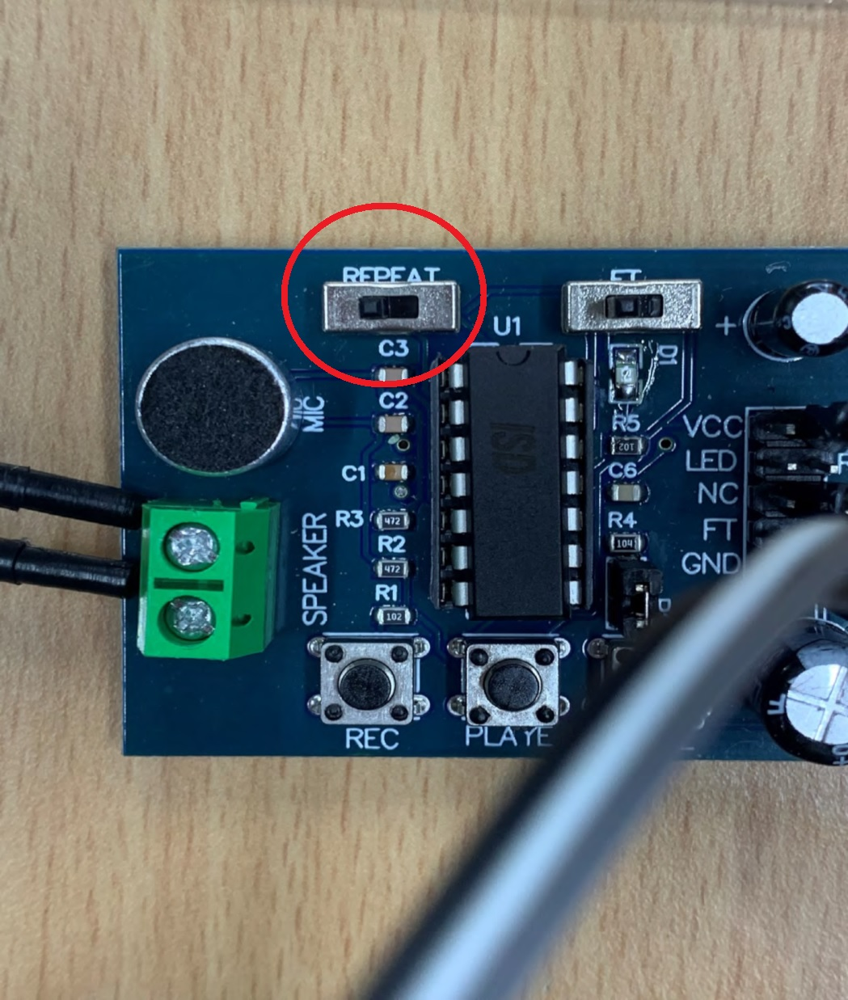

# Ultrasonic Voice Alert - Updated by Stephanie Fletcher Davey
 Build a simple alert that speaks or chimes when people come within range.

Build a simple alert for when people get too close to keep their distance and wash their hands. As the ultrasonic sensor detects the person getting too close,  it will use the record and playback module to playback a pre-recorded message. Use it to remind people to wash their hands or as an alert to keep them at a distance. Has a handy mute button and 3 indicator lights to let the person know how close they are to you.

## Bill Of Materials
| Qty | Code                                     | Description                                  |
| --- | ---------------------------------------- | ---------------------------                  |
| 1   | [XC3902](https://jaycar.com.au/p/XC3902) | Arduino Board, Jumpers, Breadboard, and LEDs|
| 1   | [XC4605](https://jaycar.com.au/p/XC4605) | Duinotech Record and Playback Module  |
| 1   | [WC6028](https://jaycar.com.au/p/WC6028) | Female to Male Jumper Cables |
| 1   | [PH9251](https://jaycar.com.au/p/PH9251) | 9V Battery to Barrel Jack Connector             |
| 1   | [XC4442](https://jaycar.com.au/p/XC4442) | HC-SR04 Ultrasonic Sensor           |
| 1   | [AS3006](https://jaycar.com.au/p/AS3006) | 1W Round Speaker            |
| 1   | [SB2423](https://jaycar.com.au/p/SB2423) | Eclipse 9V Battery         |

### Extra Ideas

- [XC4444](https://jaycar.com.au/p/XC4444): Use a PIR sensor to detect movement instead, suitable for wider range doorways and rooms.
- [XC3744](https://jaycar.com.au/p/XC3744): Increase the volume and play louder messages.
- [XC3748](https://jaycar.com.au/p/XC3748): Use the MP3 audio player to play some tunes when people walk in.
- [XC3714](https://jaycar.com.au/p/XC3714): Use the 8 digit display to visualise the distance between the person and the device.

## How to build

For instructions, check out https://jaycar.com.au/ultrasonic-voice-alert

## How to use

Hook it up to power so it turns on, then hold the record button on the playback module so you can record a short message.

After recording the message, wave your hand in front of the ultrasonic sensor. You should find that when something passes the ultrasonic sensor, it will play back your message automatically.

### Troubleshooting

| Problem                           | Possible cause                                              |
| --------------------------------- | ----------------------------------------------------------- |
| It keeps playing back the message.| This could be caused by a few things:                       |
|                                   | Either the `REPEAT` switch is switched on, or the ultrasonic sensor is not detecting distance correctly.|
|                                   | If changing the `REPEAT` switch doesn't fix it, have a look at the Serial monitor for what the sensor is doing.|
| It's not detecting movement.      | Check the wiring to the ultrasonic sensor.                  |

Ensure your repeat switch is in this position:

